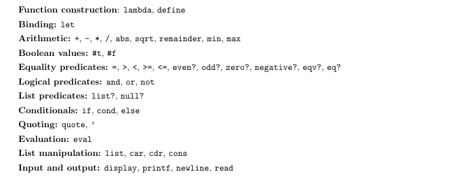
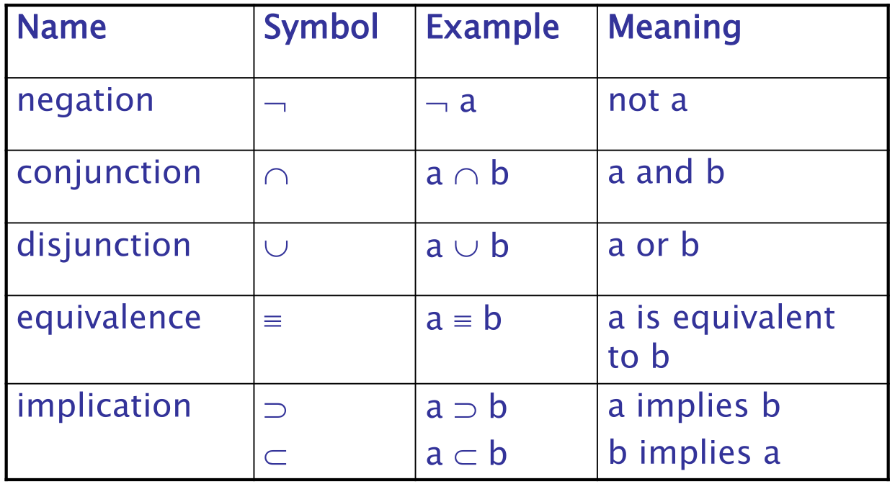
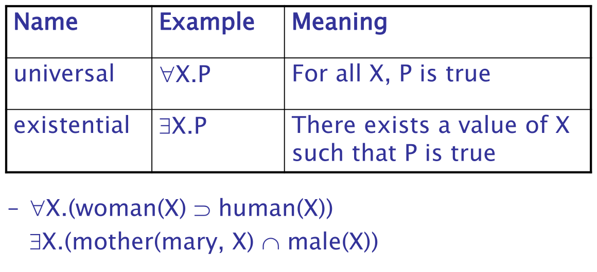

# SWI-Prolog and Racket Scheme Project

This project contains Prolog and Scheme code demonstrating the use of facts, rules, and functions.

## Creating Prolog Code

1. Create a new file with a `.pl` extension. This is the standard extension for Prolog files. For example, `example.pl`.
2. Open the file in a text editor and write your Prolog code. For example:

```prolog
% Defining facts
parent(john, jim).
parent(john, ann).

% Defining rules
sibling(X, Y) :- parent(Z, X), parent(Z, Y), X \= Y.
```

3. Save the file and close it.

## Creating Scheme Code

1. Create a new file with a `.scm` extension. This is the standard extension for Scheme files. For example, `example.scm`.
2. Open the file in a text editor and write your Scheme code. For example:

```scheme
(define (square x) (* x x))
```

3. Save the file and close it.

## Running the Code

1. Navigate to the directory containing the code files.
2. Run the Prolog environment with your file:

```bash
swipl -s example.pl
```

3. Run the Scheme environment with your file:

```bash
racket example.scm
```

4. In the Prolog environment, you can now query your facts and rules. For example:

```prolog
?- sibling(jim, ann).
```

This will check if Jim and Ann are siblings according to the defined facts and rules.

5. In the Scheme environment, you can now call your functions. For example:

```scheme
(square 5)
```

This will calculate the square of 5 according to the defined function.

6. To exit the Prolog or Scheme environment, use the `halt.` command in Prolog or `(exit)` in Scheme.

This README provides instructions on how to create Prolog and Scheme files, write Prolog and Scheme code, and run the code using the SWI-Prolog and Racket Scheme environments.


## Food For Thought:

- ### `Functional Programming`



- ### `Predicate Calculus:Logical Operators`



- ### `Predicate Calculus: Quantifiers`



- ### `Sorting a List`

  - In an imperative language (procedural)
    - Describe an algorithm for sorting the list
    - Computer executes the steps of the algorithm
  - In a logic language (non-procedural)
    - Describe the characteristics of a sorted list, not the process of rearranging a list:
    - sort(old_list, new_list) `(b implies a)` permute(old_list, new_list) `(conjunction)` sorted (new_list)
    - sorted (list) `(b implies a)` `(universal)`j such that `1 <= j < n`, list(j) `<=` list(j+1)

---
